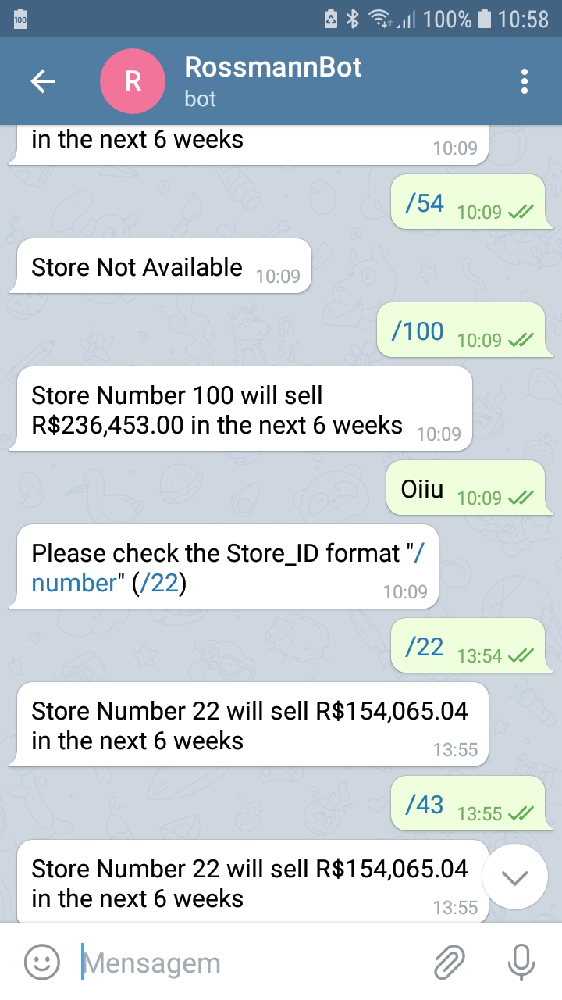
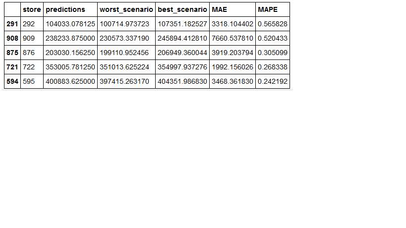

# Machine Learning Regression Model
The main objective of this project is to demonstrate my skills in solving business challenges through my knowledge and tools of Data Science.

    

In this project, I developed a Machine Learning regression predictive model able to predict daily sales for up to six weeks in advance. 
## **Implemented Model**: XGBoost , a supervised regression models , gradient boosting implementation (ensemble machine learning algorithms).

    

**Measure metrics**: 
**MAE:  664.97**

What is it? mean absolute error. Sum of all real values minus predicted values -disregarding the sign- divided by the total.

**MAPE: 0.0975 or 9,7% error**

What is it? It´s like MAE but in percentage. 

**RMSE:  957.77** 

What is it? It shows how far predictions fall from measured true values using Euclidean distance. In other words, in the presented model, the prediction varies around $ 957,77 comparing to real values.

## **Deployment solution:**
@ Heroku

A telegram bot , enter the store code and receive the predition.

